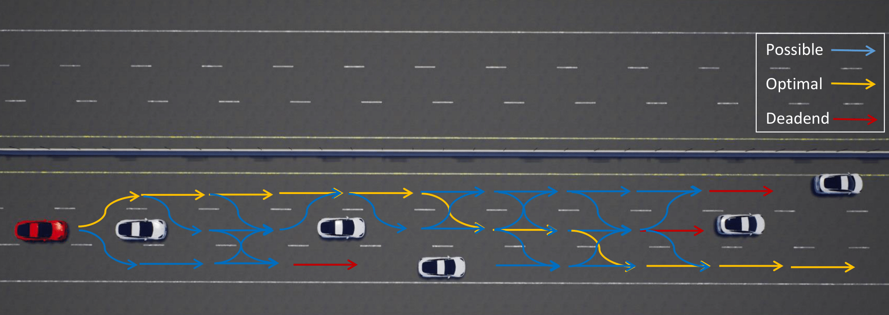

# CC-SSP planner

The following code is the CC-SSP [1] risk-aware planner. The code is based on the DWA planner, mainly the trajectory generation and trajectory scoring.

## Code structure:
* ccssp_planner_ros: acts as a ROS interface by setting the configurable parameters, acquiring the local plan from dwa_planner, and publishing the local plan.
* ccssp_planner: receives the planner parameters, generates the trajectories (using base_local_planner), and acquires the local plan from scored_planner.
* scored_planner: is a modified code that computes the cost of each trajectory based on a set of cost functions, and computes the risk as well, and sends it to the ccssp class.
* ccssp: is the CC-SSP planner file; it uses Gurobi solver to solve the problem using input from scored_planner.
* CCSSPPlanner.cfg: is the configuration file, which includes the risk threshold parameter (risk_cc).

## Configration:
* First select the CC-SSP planner in the move_base lauch file  <node pkg="move_base" type="move_base" respawn="false" name="move_base" output="screen">
    <param name="base_local_planner" value="ccssp_local_planner/CCSSPPlannerROS" />
* Second: change the local_planner config file: 1) CCSSPPlannerROS: instead of DWAPlannerROS:,  and 2) define risk_cc and planning_h.
  

[1] Dual Formulation for Chance Constrained Stochastic Shortest Path with Application to Autonomous Vehicle Behavior Planning. IEEE-CDC 2021
